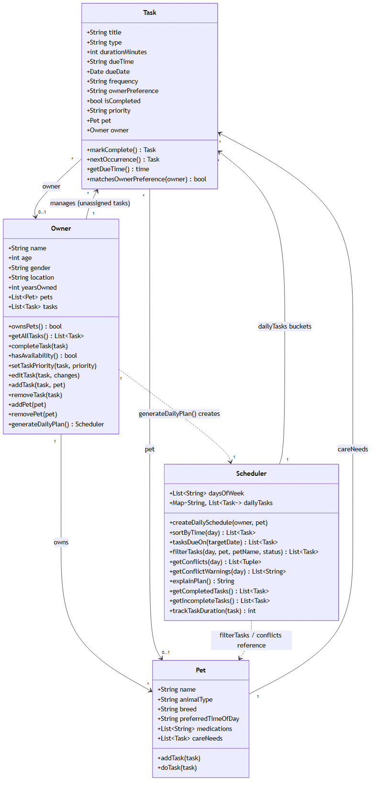

# PawPal+

An AI-enhanced pet care scheduler: a deterministic Python scheduling engine, wrapped in a
Streamlit UI, extended with a retrieval-augmented, agentic AI assistant that drafts new
care tasks grounded in real care guidelines and self-corrects for scheduling conflicts
before a human ever approves them.

## Original project (CodePath AI110, Modules 1–3)

**PawPal+** started as a Module 2 class project: a Streamlit app that helps a pet owner
plan care tasks for one or more pets. The original goal was to design a small object
model (`Owner`, `Pet`, `Task`, `Scheduler`) from a UML diagram first, then implement
deterministic scheduling logic on top of it — no AI involved. That original system takes
an owner's tasks (walks, feeding, meds, grooming, etc.) and builds a weekly schedule that
sorts by priority/time/duration, filters by day/pet/status, detects and explains
overlapping time slots (including tasks that span midnight), and automatically spawns the
next occurrence of daily/weekly recurring tasks when they're marked complete.

Everything in this README past the "Architecture Overview" section describes what was
added on top of that original system for the AI extension.

## Title & Summary

**PawPal+: an AI-enhanced pet care scheduler.**

Pet owners often know *what* their pet needs (a Golden Retriever needs daily exercise, a
cat on medication needs a consistent dosing time) without knowing how to turn that into a
concrete, conflict-free schedule. PawPal+'s rule-based core already builds and explains a
weekly plan from tasks you give it. The AI layer on top closes the other half of the gap:
given just a pet's species, breed, and medications, it retrieves relevant care guidance,
asks an LLM to draft specific tasks grounded in that guidance, checks those drafts against
the pet's real schedule for time conflicts, and hands the (human-approved) result back into
the same scheduler — so the AI's output is never just text in a chat window, it's real
`Task` objects flowing through the same logic as everything else in the app.

## Architecture Overview

Full diagram: [`diagrams/ai_system_diagram.mmd`](diagrams/ai_system_diagram.mmd) (Mermaid
flowchart). Core class model: [`diagrams/uml_final.mmd`](diagrams/uml_final.mmd).

```
Input (pet/owner profile, existing schedule)
   -> Retriever            care_knowledge.retrieve_guidelines()
   -> Agent                CareAgent: Claude (grounded in retrieved text) or offline fallback
   -> Guardrail/Validator  ai_agent._validate_draft() — bounds/type/enum checks
   -> Agentic correction   ai_agent._resolve_conflicts() — reuses Scheduler's own conflict logic
   -> Output               AgentResult -> Streamlit UI / CLI
   -> Human review         user reads sources + warnings, clicks "Add these tasks" (or doesn't)
   -> Testing/logging      pytest suite + pawpal_agent.log trace every stage above
```

In words: a pet's profile is scored against a small local knowledge base of care
guidelines (the **retriever**); the top matches are handed to Claude as grounding context
for a JSON-schema-constrained task-drafting request (the **agent**); every draft is
validated against hard constraints before it can become a real `Task` (the **guardrail**);
each validated draft is then checked against the pet's *existing* tasks and nudged forward
in time until it stops colliding, using the exact same overlap check the rest of the
scheduler uses (the **agentic self-correction** step); and only after a **human** reviews
the drafted tasks and explicitly clicks "Add these tasks" do they become part of the real
schedule. If the LLM call is unavailable or fails for any reason, the agent transparently
falls back to a deterministic template-based draft built from the same retrieved
guidelines, so the feature — and the app — never breaks.

## Setup Instructions

```bash
git clone <this-repo-url>
cd project4
python -m venv .venv
source .venv/bin/activate       # Windows: .venv\Scripts\activate
pip install -r requirements.txt
```

Run the CLI demo:

```bash
python main.py
```

Or launch the Streamlit app:

```bash
streamlit run app.py
```

Run the test suite:

```bash
pytest
```

### Enabling live Claude-generated suggestions (optional)

The AI Care Assistant works with **zero setup** — it falls back to a deterministic offline
draft if no API key is configured. To enable real Claude-generated suggestions instead:

```bash
cp .env.example .env
# then edit .env and set:
# ANTHROPIC_API_KEY=sk-ant-...
```

`ai_agent.py` loads `.env` automatically — no other code changes needed. Either way, check
`pawpal_agent.log` after a run to see whether it used the live LLM or the offline fallback,
and why.

## Sample Interactions

These were captured directly from `CareAgent.plan_care_tasks()` (no API key configured in
this environment, so they exercise the deterministic offline-fallback path — the same
interface produces LLM-grounded rationale when `ANTHROPIC_API_KEY` is set; only the source
of the draft changes, not the pipeline around it).

**1. A dog with an empty schedule** — retrieval pulls dog-specific guidelines and drafts a
starter routine:

```
Input:  Pet(name="Rex", animal_type="dog", breed="Golden Retriever",
             preferred_time_of_day="morning"), no existing tasks

Output: used_llm=False
        sources: ['Daily exercise for dogs (dog-exercise)',
                   'Feeding schedule for dogs (dog-feeding)',
                   'Grooming for dogs (dog-grooming)']
        tasks:
          - Walk       [exercise] due=8:00 AM  freq=daily  priority=high dur=30min
          - Feed       [feeding]  due=7:00 AM  freq=daily  priority=high dur=10min
          - Brush coat [grooming] due=6:00 PM  freq=weekly priority=low  dur=15min
```

**2. A cat with a conflicting existing task** — this is the agentic self-correction step in
action. Whiskers already has a 7:00–7:10 AM feeding task; the drafted "Feed" task would
also default to 7:00 AM, so the agent nudges it forward until it clears:

```
Input:  Pet(name="Whiskers", animal_type="cat", breed="Siamese",
             preferred_time_of_day="evening"),
        existing_tasks=[Task("Feed Whiskers", "feeding", 10, due_time="7:00 AM")]

Output: used_llm=False
        sources: ['Enrichment for indoor cats (cat-enrichment)',
                   'Feeding schedule for cats (cat-feeding)',
                   'Litter box maintenance for cats (cat-litter)']
        tasks:
          - Play session     [enrichment] due=5:00 PM freq=daily priority=medium dur=15min
          - Feed             [feeding]    due=7:30 AM freq=daily priority=high   dur=5min   <- nudged from 7:00 AM
          - Clean litter box [cleaning]   due=8:00 AM freq=daily priority=medium dur=10min
```

**3. A senior dog on medication** — retrieval correctly prioritizes the senior-care
guideline (it matches two profile terms: "senior" and "arthritis"), which outranks the
generic dog guidelines and pushes the plain dog-feeding guideline out of the top 3:

```
Input:  Pet(name="Biscuit", animal_type="dog", breed="Senior Labrador",
             medications=["arthritis medication"])

Output: used_llm=False
        sources: ['Care adjustments for senior pets (senior-pet)',
                   'Daily exercise for dogs (dog-exercise)',
                   'Feeding schedule for dogs (dog-feeding)']
        tasks:
          - Gentle walk [exercise] due=9:00 AM freq=daily priority=medium dur=15min
          - Walk        [exercise] due=8:00 AM freq=daily priority=high   dur=30min
          - Feed        [feeding]  due=7:00 AM freq=daily priority=high   dur=10min
```

(Note the medication guideline itself narrowly missed the top-3 cutoff here — see
*Design Decisions* below for why that's a known, deliberate trade-off rather than a bug.)

## Design Decisions

- **The AI layer is additive, not a replacement for the rule-based core.** Every AI-drafted
  task becomes an ordinary `Task` object and flows through the exact same `Scheduler` as
  manually-entered tasks. Concretely, `_resolve_conflicts()` calls
  `Scheduler._windows_overlap()` directly instead of reimplementing overlap logic, so "no
  conflict" means the same thing everywhere in the app. Trade-off: the AI module is coupled
  to the scheduler's internal (underscore-prefixed) methods, which is acceptable inside one
  small codebase but wouldn't be the right call for a library boundary.
- **Keyword retrieval instead of embeddings/a vector store.** The knowledge base is a
  couple dozen short documents, so exact whole-word matching against the pet's profile
  terms is enough — it costs no extra dependencies, needs no index to build, and is fully
  deterministic offline. Trade-off: recall is exact-word based, not semantic. This was not
  theoretical — an early version matched keywords as *substrings* in either direction,
  which let `"old"` silently match inside `"golden"` (as in "Golden Retriever") and pull in
  an irrelevant senior-pet guideline for a young dog. A test written specifically to check
  retrieval relevance caught it immediately; the fix was switching to exact whole-word
  matching (see `care_knowledge.retrieve_guidelines`).
- **`top_k=3` with alphabetical tie-breaking on equal score.** Deterministic ordering
  matters more here than "smartest possible pick," because the offline fallback path has to
  reproduce the same drafts every time with no LLM involved. The visible cost of that
  choice shows up in Sample Interaction 3 above: the medication guideline scores equally
  with two generic dog guidelines and loses the alphabetical tie-break, so it's dropped from
  the top 3 even though it's arguably just as relevant. A production version would probably
  rank by score first and use recency or specificity as the tie-break instead of `doc_id`.
- **JSON-schema-constrained LLM output** (`output_config.format` on the Claude request)
  instead of asking for free text and parsing it. This removes an entire class of "the
  model almost gave me valid JSON" bugs and lets `_validate_draft()` focus purely on
  business-rule checks (duration bounds, allowed priority/frequency values) rather than
  defensive parsing.
- **Fail open to the offline fallback, always.** `_call_llm()` wraps the entire API call in
  a broad `try/except` and treats *any* failure — no key configured, network error, rate
  limit, or an explicit model refusal — identically: log it and fall back to
  `_fallback_tasks()`, which builds drafts from the same retrieved guidelines' templates.
  This was a deliberate choice over checking for an API key up front, because it means the
  feature degrades gracefully for a whole class of failures I can't fully enumerate ahead of
  time, not just the "no key" case.
- **A human always approves before anything changes the real schedule.** The Streamlit UI
  shows the drafted tasks, their sources, and any unresolved conflict warnings, but only
  registers them as real tasks (and regenerates the schedule) when the user clicks "Add
  these tasks." The trade-off is one extra click; the benefit is that no AI-drafted task can
  silently alter a pet's actual care schedule.
- **Plain-file logging over a full observability stack.** Every retrieval, LLM call/
  failure, validation rejection, and conflict nudge is written to `pawpal_agent.log`. That's
  a deliberately low-tech choice — good enough to answer "what did the assistant actually do
  and why" for a project this size, without pulling in a logging/metrics service that would
  be overkill here.

## Testing Summary

```bash
pytest        # 30 passed
```

- **17 tests** (`tests/test_pawpal.py`, from the original project) cover the core
  scheduler: chronological sorting with mixed time formats, priority-before-time ordering,
  daily/weekly recurrence, conflict detection (including identical times, near-misses,
  midnight-spanning overlaps, and completed tasks being excluded), and edge cases like a
  pet with no tasks or an owner with no pets.
- **13 tests** (`tests/test_ai_agent.py`, new for the AI layer) cover: retrieval relevance
  per species and for a pet on medication, retrieval returning nothing for a blank profile,
  draft validation (accepting well-formed drafts, rejecting missing titles and out-of-bounds
  durations, defaulting unknown priorities, dropping unparseable due times), conflict
  nudging (both the conflicting and the non-conflicting case), and two end-to-end tests that
  run the full offline-fallback pipeline and assert every produced task is within bounds and
  free of the input conflict.
- **What worked well:** writing the retrieval tests *before* trusting the retrieval logic
  paid off immediately — see the "old"/"golden" substring bug described in *Design
  Decisions*. It was caught by a test, not by manually eyeballing output.
- **What I'd test next:** the tests exercise the offline-fallback path exclusively, since
  this environment has no API key configured — the live-LLM code path (`_call_llm`) is
  covered structurally (the JSON schema, the `stop_reason == "refusal"` check, the broad
  exception handling) but isn't asserted against a mocked Claude response. Mocking the
  `anthropic` client to test malformed-JSON and refusal handling directly is the natural
  next test to add.
- **Manual verification:** ran `python main.py` end-to-end (confirmed the CLI's AI section
  logs correctly and produces conflict-free suggestions) and smoke-tested
  `streamlit run app.py` (loads with no server-side exceptions, "Suggest care tasks" and
  "Add these tasks" both work in the browser).

## Reflection

Building the AI layer on top of an already-working rule-based system clarified something
I hadn't fully internalized before: an AI feature is only as trustworthy as the guardrails
around it, not the model itself. The most useful design decisions here weren't about
prompting — they were about what happens *before* the LLM is called (retrieval scoping) and
*after* it responds (schema-constrained output, field validation, conflict re-checking, and
a human approval step). Given the choice, "make it grounded and recoverable" beat "make the
prompt clever" every time. The substring-matching bug was also a good reminder that testing
the deterministic, non-AI parts of an AI pipeline (retrieval scoring, validation rules) is
just as important as testing the AI call itself — most of the bugs I actually hit were in
that "boring" surrounding code, not in anything Claude generated.

(The graded responsible-AI reflection — how I collaborated with AI tools while building
this, one helpful and one flawed AI suggestion I encountered, and this system's known
limitations — is in `model_card.md`, not here.)

## ✨ Core Scheduler Features (original project)

- **Priority + time + duration sorting** — `Scheduler.create_daily_schedule()` orders each day's tasks by priority (high → medium → low) first, then by due time, then by duration, so the most important care needs surface at the top of the plan.
- **Sort by time only** — `Scheduler.sort_by_time(day)` re-sorts a day chronologically by due time alone, ignoring priority, for a strict timeline view.
- **Filtering** — `Scheduler.filter_tasks()` narrows a schedule by day, pet (instance or name), and completion status, applied cumulatively (AND) so views like "Rex's pending tasks on Monday" are one call.
- **Conflict detection** — `Scheduler.get_conflicts()` does a pairwise scan of each day's due-time windows (accounting for task duration and midnight-spanning tasks) to flag overlaps, whether it's the same pet double-booked or two different pets needing the owner at once.
- **Conflict warnings** — `Scheduler.get_conflict_warnings()` turns detected conflicts into human-readable messages (e.g. "'Walk Rex' (9:30 AM) overlaps with 'Brush Rex' (9:30 AM) - both scheduled for Rex."), surfaced in the Streamlit UI as `st.warning`/`st.success` banners.
- **Daily & weekly recurrence** — `Task.mark_complete()` calls `Task.next_occurrence()` to automatically spawn the next instance of a task, advancing `due_date` by one day for `"daily"` tasks or one week for `"weekly"` tasks, so completing a task keeps it on the schedule going forward.
- **Frequency-to-day mapping** — `Scheduler._days_for_task()` resolves a task's `frequency` field (daily, weekly, a specific weekday, or a comma-separated list of weekdays) into the set of weekday buckets it should appear in.
- **Owner preference matching** — `Task.matches_owner_preference()` checks a task's preferred time of day against the pet's `preferred_time_of_day` (or general owner context when unassigned to a pet).
- **Plan explanation** — `Scheduler.explain_plan()` summarizes the sorting rule used, per-day task/completion counts, and a rollup of any detected conflicts, in plain text.
- **Completion tracking** — `Scheduler.get_completed_tasks()` / `get_incomplete_tasks()` and `Scheduler.track_task_duration()` report status and total scheduled minutes across every day a recurring task appears.

## 📐 Class Diagram



Source: [`diagrams/uml_final.mmd`](diagrams/uml_final.mmd)
