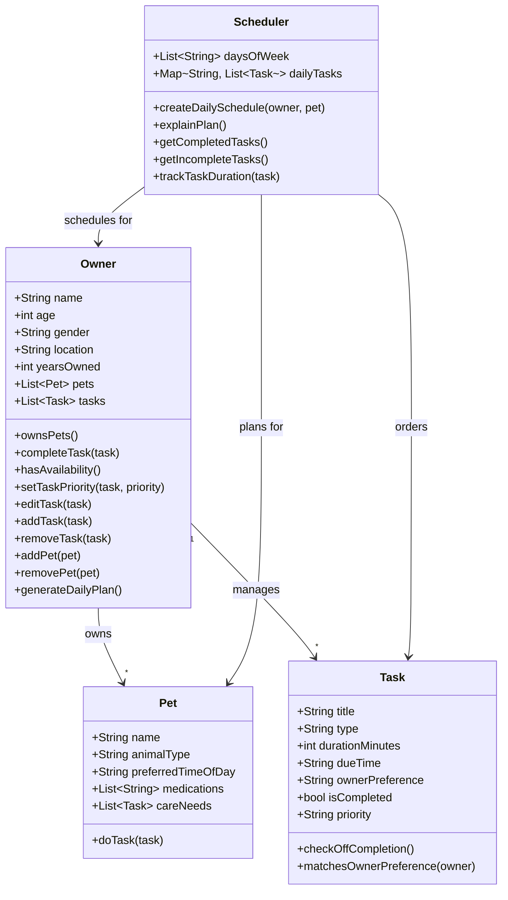

# PawPal+ Project Reflection

## 1. System Design

**a. Initial design**

- Briefly describe your initial UML design.
- What classes did you include, and what responsibilities did you assign to each?

My initial UML design contain main classes including pet care Tasks and Scheduler. These are the necessary basic classes or actions that the design needs to incorporate. Some other classes that will be needed include Owner and Pet so that the app will allow a user to input their personal information and their pet's information. 

The Pet class will contain information about the pet and the User class will contain information about the user. The Tasks class will take care of the necessary tasks the user would need to complete and track including walking, feeding, meds, enrichment, and groooming (these might be enums or examples of classes needed). The Scheduler class will contain subclasses including time availability (weekdays)Schedule to produce a daily plan.

Main Objects: Owner, Pet, Task, Scheduler
Owner - 
    Attributes: name, age, gender, location, how long user has owned pet, 

    Methods: owns pets, completes tasks, has time availability, has priority for what tasks or times, edit tasks, add tasks, remove tasks, remove pet, add pet, use scheduler to generate tasks daily
Pet - 
    Attributes: type of animal, preference of time for doing a task, needed meds, 
    
    Methods: do a task
Tasks - 
    Attributes: type of task (walks, feeding, meds, enrichment, grooming, etc.), how long for each task (duration), when would these tasks need to be done, owner preference for which tasks, whether a task is completed or not, priority for a task

    Methods: check off completion, check owner preference

Scheduler - 
    Attributes: days of the week, what tasks for what pet daily, 

    Methods: create a schedule of daily tasks for each pet, explain why the plan was chosen, track what tasks are completed and incomplete, track how long it takes to complete a task

**b. Design changes**

- Did your design change during implementation?
- If yes, describe at least one change and why you made it.

---

## 2. Scheduling Logic and Tradeoffs

**a. Constraints and priorities**

- What constraints does your scheduler consider (for example: time, priority, preferences)?
- How did you decide which constraints mattered most?

**b. Tradeoffs**

- Describe one tradeoff your scheduler makes.
- Why is that tradeoff reasonable for this scenario?

---

## 3. AI Collaboration

**a. How you used AI**

- How did you use AI tools during this project (for example: design brainstorming, debugging, refactoring)?
- What kinds of prompts or questions were most helpful?

**b. Judgment and verification**

- Describe one moment where you did not accept an AI suggestion as-is.
- How did you evaluate or verify what the AI suggested?

---

## 4. Testing and Verification

**a. What you tested**

- What behaviors did you test?
- Why were these tests important?

**b. Confidence**

- How confident are you that your scheduler works correctly?
- What edge cases would you test next if you had more time?

---

## 5. Reflection

**a. What went well**

- What part of this project are you most satisfied with?

**b. What you would improve**

- If you had another iteration, what would you improve or redesign?

**c. Key takeaway**

- What is one important thing you learned about designing systems or working with AI on this project?
